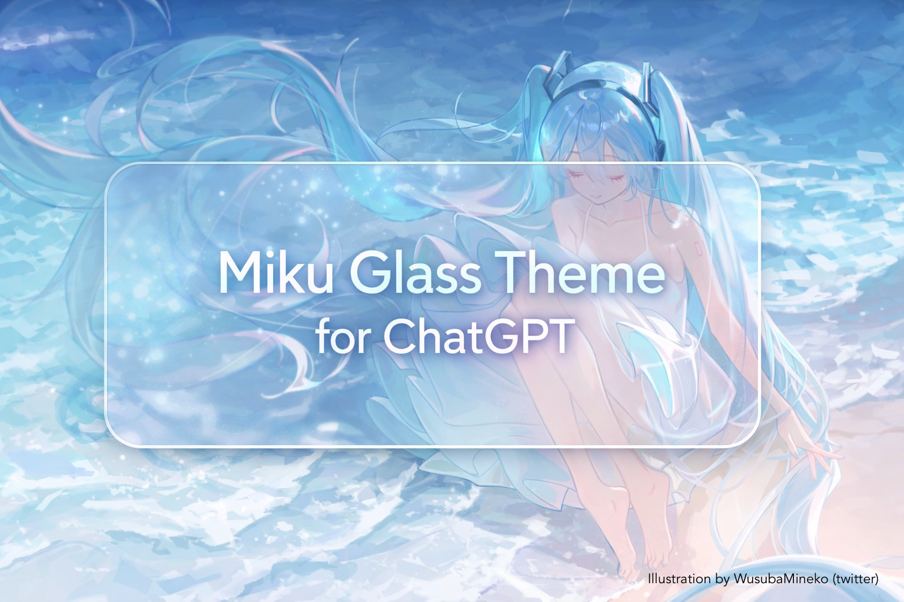

# Hastune Miku Glass Light Style for ChatGPT

  

A soft, glassmorphism-inspired ChatGPT theme featuring a serene **Hatsune Miku ocean aesthetic**.  

## Credits

- Background artwork: **WusubaMineko** (twitter)
- Theme design & CSS: **Morikana** + **ChatGPT**

## Features
  **Frosted glass UI** with subtle blur and depth
  **Miku-inspired color palette** (cool blues, soft whites)
  Smooth, modern **glassmorphism message bubbles**
  **Toggleable hover animations** for chat bubbles
  Carefully tuned shadows for readability without visual noise

## Installation
### Requirements
  Browser: Chrome / Edge / Firefox
  Extension: **Stylus**
### Steps
1. Install **Stylus**
   - Chrome / Edge: https://chromewebstore.google.com/detail/stylus
   - Firefox: https://addons.mozilla.org/firefox/addon/styl-us/

2. Install the theme  
   Open this link and Stylus will prompt installation:
   https://github.com/Mikafuu/MikuGlassForGPT/raw/main/chatgpt-glass-miku.user.css

3. Visit **https://chatgpt.com/**

## Customization

This theme includes built-in Stylus options.

### Available toggles
- **Enable ChatGPT/User message hover animation**
- ON → subtle hover lift + blur change
- OFF → bubbles stay in the “hovered” glass state permanently (clean & calm)

You can find these under:
> Stylus → Manage → Hastune Miku Glass Light Style for ChatGPT → Settings

## Notes on Performance

- Minor UI lag while **ChatGPT is responding** and **editing previous messages** is normal on ChatGPT.
- The style avoids layout thrashing and heavy filters where possible.
- If you experience visual jitter, disable hover animations

## Compatibility

- only tested on chatgpt.com
- Not tested on legacy OpenAI layouts
- Not intended for mobile browsers

## License

No license

## Final Note

This theme is a passion project made for people who want ChatGPT to feel
a little calmer, prettier, and more alive.
If you enjoy it, a ⭐ on the repo means a lot.
