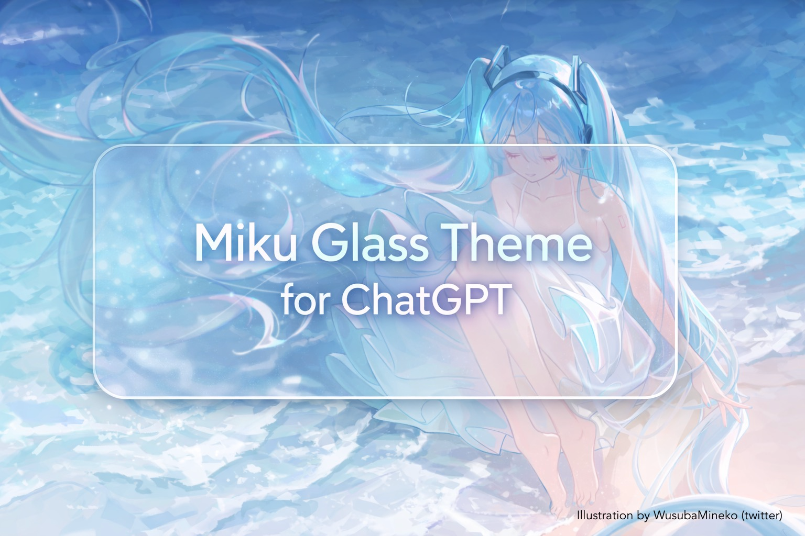

# 初音未来 ChatGPT 浅色玻璃主题

[English](README.md) | 简体中文

  

一款柔和的 ChatGPT 玻璃质感主题，以宁静的**初音未来与海洋意境**为灵感。

## 致谢

背景插画作者：**WusubaMineko**（Twitter）。[查看原作](https://x.com/WusubaMineko/status/1795989062567764263)。

## 功能特色

- **毛玻璃界面**：通过轻微模糊与层次感营造通透效果。
- **初音未来风格配色**：清冷的蓝色搭配柔和的白色。
- 流畅、现代的**玻璃质感消息气泡**。
- 可单独开关 ChatGPT 和用户消息气泡的**悬停动画**。
- 精心调整的阴影，在保持文字清晰的同时减少视觉干扰。

## 安装

### 使用要求

- 浏览器：Chrome / Edge / Firefox。
- 扩展：**Stylus**。

### 安装步骤

1. 安装 **Stylus** 扩展：
   - [Chrome / Edge]([https://chromewebstore.google.com/detail/stylus](https://chromewebstore.google.com/detail/clngdbkpkpeebahjckkjfobafhncgmne?utm_source=item-share-cb))
   - [Firefox](https://addons.mozilla.org/firefox/addon/styl-us/)
2. [打开主题安装链接](https://github.com/Mikafuu/MikuGlassForGPT/raw/main/chatgpt-glass-miku.user.css)，Stylus 会提示安装。
3. 访问 [ChatGPT](https://chatgpt.com/)，即可使用主题。

## 自定义设置

本主题提供内置的 Stylus 设置选项。

### 可用开关

ChatGPT 和用户消息气泡分别提供悬停动画开关：

- **开启**：鼠标悬停时，气泡会轻微上浮，并改变模糊效果。
- **关闭**：气泡始终保持悬停时的玻璃效果，视觉表现更稳定、简洁。

设置入口：

> Stylus → 管理 → Hastune Miku Glass Light Style for ChatGPT → 设置

## 性能说明

- 在 **ChatGPT 生成回复**或**编辑之前的消息**时，可能出现轻微的界面卡顿。
- 本主题尽可能避免反复触发布局计算和使用开销较大的滤镜。
- 如果遇到画面抖动，可以尝试关闭悬停动画。

## 兼容性

- 目前仅在 Chrome 浏览器的 chatgpt.com 网站上进行过测试。

## 许可证

暂未指定许可证。

## 写在最后

这是一个出于热爱而制作的主题，希望让 ChatGPT 的界面更宁静、更美观，也更有生气。

如果你喜欢这个主题，欢迎为仓库点一颗 ⭐，这对我来说是很大的鼓励。
